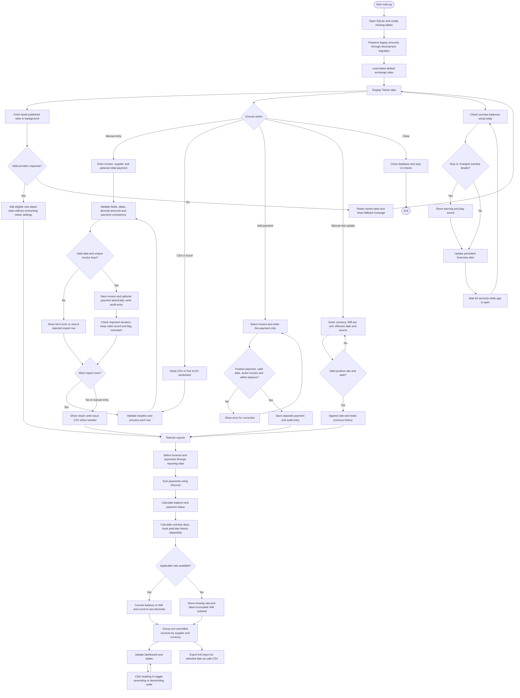
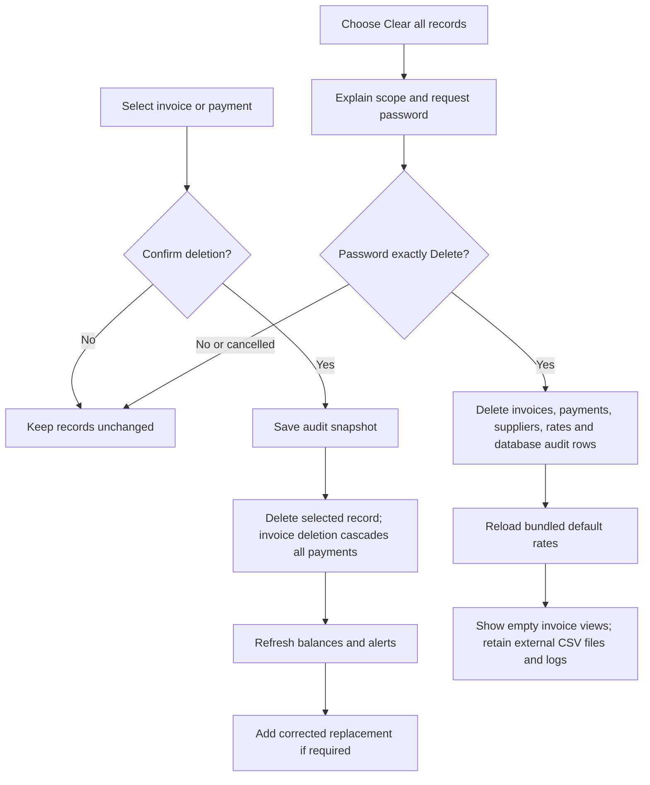

# Vendor Invoice Intelligence System

A Python-only Tkinter desktop application for a two-member Core Python capstone. It stores invoices and individual payments in SQLite, calculates outstanding and overdue balances, maintains dated exchange rates, and exports CSV reports.

### CSV and Excel import

Use **Import CSV or Excel** beside **Save new invoice** on the **Add invoice** tab, or use the same option on **Import & export**. This imports rows as saved invoices, rather than filling the manual form. A result dialog shows accepted rows and issues.

Supported formats: `.csv` and `.xlsx`. Excel import reads the first worksheet, using row 1 as the column headers with the same names as the sample CSV. Native Excel date cells are supported. Empty rows are skipped, optional blank fields are allowed, and formula cells are rejected: paste values before importing. Save legacy `.xls` files as `.xlsx` first. Run `python -m pip install -r requirement.txt` to install the Excel reader, openpyxl.

## Setup on Windows

The submission does not include a virtual environment. Create one on your own PC using the steps below. Open PowerShell and enter the project folder (adjust the location if needed):

```powershell
cd "C:\Users\NullVoid\Desktop\Cisco-pythonGenAI\Saurav_Kumar_Jaiswal"
python --version
python -c "import tkinter, sqlite3; print('Tkinter and SQLite available')"
```

Install Python 3.10 or newer from https://www.python.org/downloads/windows/ with **Tcl/Tk and IDLE** and **Add Python to PATH** selected. Excel import uses openpyxl; the other application features use Python standard-library modules. Pytest is required only for tests.

Open PowerShell in this folder:

```powershell
python -m venv .venv
.\.venv\Scripts\python.exe -m pip install -r requirement.txt
.\.venv\Scripts\python.exe main.py
```

If `python` is unavailable but the Python launcher is installed, use `py` for the first command. No separate SQLite server or database installation is needed.

The commands above do not require activation. If you prefer an activated environment:

```powershell
.\.venv\Scripts\Activate.ps1
python -m pip install -r requirement.txt
python main.py
```

If PowerShell blocks scripts, use the no-activation commands or allow scripts for this terminal session only:

```powershell
Set-ExecutionPolicy -Scope Process -ExecutionPolicy Bypass
.\.venv\Scripts\Activate.ps1
```

Copy `.\.venv` exactly; `..venv` is a different path. Run `deactivate` when finished with an activated environment. Close and reopen the app after code updates. On subsequent runs, use `.\.venv\Scripts\python.exe main.py`; there is no need to recreate the environment each time.

```powershell
.\.venv\Scripts\python.exe -m pytest -q
```

## Everyday workflow

### Select the reporting currency

Use **Report currency** beside the reporting date at the top of the window. INR is selected by default on each launch. Available choices are INR, USD, EUR, GBP, CNY, SEK, BRL, CAD and JPY. The outstanding conversion column and Overview converted total update immediately. Original invoice amounts and vendor summaries retain their source currencies.

Cross-currency calculation: `original balance × INR per source unit ÷ INR per target unit`. Each rate is selected for the reporting date. Same-currency reporting needs no exchange rate. Missing source or target rates are shown explicitly; converted values are rounded to two decimals. The rate-entry tab continues to store INR-per-unit rates as the common conversion basis.

Invoice CSV exports contain `outstanding_converted` and `reporting_currency` so the selected unit is explicit. These replace the earlier INR-only converted column. Vendor summary exports remain grouped by original currency.

### Default rates, alerts, sorting and clearing

- The app starts with a bundled Frankfurter reference-rate snapshot dated 2026-09-21 and checks the public endpoint for the latest published rates in a background thread. Weekends/publication delays may mean the latest date is earlier than today. The Exchange rates tab displays provider status and retains manual updates and a **Refresh online rates** button. Existing same-date/newer rates are not overwritten by automatic imports. Saved rates remain available offline; their dates are visible. Historical reports never use future rates.
- A startup warning and Overview alert show today's overdue balances grouped by currency, excluding fully paid/cancelled invoices. The app checks every 60 seconds while open and alerts again when overdue balances/days change. No background monitoring or notifications run after the app closes. **Open overdue invoices** switches to today's overdue list.
- Click any table column header to sort ascending; click again for descending. Money/count columns sort numerically, dates chronologically and names alphabetically. Arrow indicators show the order, which survives table refreshes. Missing numeric values stay last.
- **Import & export → Clear all records / clean database** requires the exact case-sensitive password `Delete`. It removes invoices, payments, suppliers, stored exchange-rate history and database audit rows in one transaction, then restores default rates. External CSV files and logs remain. This fixed password is an accidental-deletion guard, not user authentication or encrypted storage. The implementation was tested only against temporary databases; existing user records were not cleared during development.

Reference-rate endpoint: https://api.frankfurter.dev/v1/latest?base=INR . The provider supplies currency units per INR; the app takes the reciprocal to obtain INR per currency unit. Only a public rate request is sent, with no invoice information.

1. Start with **Import & export → Import supplied sample dataset**, or use **Add invoice**.
2. On the manual form, invoice state is active/cancelled. Paid, unpaid, partial, and overdue indicators are computed; users do not type them.
3. View invoices and apply supplier/invoice searches and status filters.
4. Select an invoice and add each new payment separately in its original currency. The payment entry is the new amount, not total paid so far.
5. Use **Exchange rates** to review default rates or enter INR per one unit, an effective date, and a source. A manual rate for the same date supersedes the earlier entry for calculations while both remain in history.
6. Choose a reporting date, refresh, and export invoice or vendor reports. Reports include all invoices for that date; the search filter only affects the invoice table.
7. Saved invoice and payment records cannot be edited. Delete after confirmation and add a corrected replacement. Deleting an invoice deletes all linked payments, including payments later than the selected reporting date. An audit snapshot remains in SQLite.

The database and log are created inside `files/` on launch. Close the app before copying its database for backup. Use separate development databases for each teammate; this is a single-user local application, not a shared network service.

## Data and calculation rules

- One invoice belongs to one supplier. `(supplier_id, invoice_number)` and `invoice_id` are unique.
- A supplier ID cannot silently change name/tax details. Identically named suppliers with different IDs remain separate.
- All supported currencies accept non-negative amounts with up to 12 decimal places, including fractional JPY values. Amounts are stored as exact decimal text in the existing scaled-unit representation and summed with `Decimal`, avoiding SQLite floating-point SUM. Legacy integer databases migrate automatically on opening without changing their monetary values. Non-finite values, negative amounts and invalid dates are rejected; displayed INR conversions are still rounded to two decimals.
- `paid = sum(payments)`; `outstanding = invoice amount - paid`. Cancelled invoices are excluded from financial summaries and their payable balance is zero.
- An outstanding invoice becomes overdue only after its due date. Fully paid invoices can be marked paid late without appearing as unpaid overdue debt.
- The reporting date filters invoice issue dates and payment dates. Imported cancellation history is unavailable, so past cancellation states cannot be reconstructed.
- For a source currency, use the latest rate effective on/before the reporting date. INR is always 1. Converted balances are rounded to paise using half-up rounding. Missing rates are explicit and the dashboard labels a partial INR sum as a subtotal.
- INR equivalents are reporting-date valuations, not historical payment accounting. Payment entry in another currency, refunds, tax-law checks and PDF/OCR extraction are outside scope. Online published reference rates are supported; continuously changing trading quotes are not.
- New zero-amount active invoices are rejected; zero-amount cancelled source invoices are allowed. Cancellation of an invoice with payments requires review outside this workflow.

## Input schema and source

The original unmodified sample is `files/supplier-invoice-payment-timelines.csv`, obtained by the user from:
https://gomask.ai/marketplace/datasets/supplier-invoice-payment-timelines

It contains 200 synthetic records and 19 columns. Required import columns:
`invoice_id, supplier_id, supplier_name, invoice_number, invoice_date, invoice_due_date, invoice_amount, currency`.

Optional columns include `supplier_tax_id, invoice_submission_date, payment_amount, payment_date, payment_method, payment_reference, payment_status, days_to_payment, is_overdue, created_at, updated_at`.

Source creation/update timestamps remain in the original CSV; database timestamps describe local entry. Source status, days, and overdue flags are retained for reference but current calculations use invoice/payment facts. One aggregate source payment becomes one imported payment record; unavailable payment history is not invented.

Missing payment amount/date means no payment record. Imported rows are committed separately, so valid rows survive failures in other rows. `files/import_issues.csv` records rejected rows and duration warnings from the most recent import with issues. Fractional JPY values are preserved without rounding; all 200 supplied records now import, with one duration warning. Duplicate reimports are rejected without changing saved invoices. Reimporting after a previous 199-record import adds the formerly rejected record while preserving existing invoices.

## OOP and modules

| Module | Responsibility |
|---|---|
| main.py | InvoiceApp, Tkinter tabs, form entry, confirmations and messages |
| models.py | Immutable Invoice and Payment domain objects |
| validation.py | Required fields, exact decimal amounts, ISO dates and currencies |
| database.py | InvoiceRepository, SQLite schema, queries and audit persistence |
| invoice_service.py | InvoiceService, atomic validation/storage, payment and delete operations |
| currency.py | CurrencyConverter, dated rate history and INR conversion |
| reports.py | ReportGenerator, invoice views and grouped financial summaries |
| csv_handler.py | CSV import and spreadsheet-safe report export |
| ui_helpers.py | Type-aware column sorting and overdue alert summaries |
| test_main.py | Pytest checks against temporary databases |

Encapsulation groups invoice status and balance behavior with Invoice data. Composition connects the service, repository, converter, and reporter. Lists hold records, dictionaries map fields and summaries, tuples form grouping keys, and sets check CSV schema and missing currencies. Inheritance is used for the UI (`InvoiceApp` extends Tk), not artificially added to financial models.

## Team allocation

Member 1: models, database, validation, invoice service, CSV import, and associated tests.

Member 2: Tkinter UI, currency conversion, reports, documentation and associated tests.

Both: agree function interfaces, integration checks, review AI-generated code, and deliver a 5–10 minute demo.

## Detailed functional flow diagram

These Mermaid diagrams render on GitHub and compatible Markdown viewers. A plain-text overview follows for other viewers.



### Correction and database clearing flow



### Plain-text overview

```text
Start -> SQLite initialization/migration -> Default rates -> Tkinter tabs
    Manual entry / CSV / Excel -> Validation -> Save -> Audit
    Invalid input -> Form error or import-issues CSV
    Additional payment -> Validate against balance -> Save -> Audit
    Exchange-rate update -> Append dated rate -> Recalculate
    Individual deletion -> Confirm -> Audit snapshot -> Delete -> Replace
    Clear database -> Require Delete -> Clear -> Restore default rates
Reporting date -> Sum payments -> Balance/status -> Overdue days
    -> Applicable exchange rate -> INR value -> Vendor summary -> UI/CSV
Separately: today's overdue check -> Alert on change -> Repeat while open
Close -> End database connection and alert checks
```

## Database design and data structures

| Table | Main fields and relationships |
|---|---|
| suppliers | Supplier ID primary key, supplier name and tax ID |
| invoices | Invoice ID primary key, supplier foreign key, number, dates, currency, amount, cancellation flag and source metadata |
| payments | Payment ID, invoice foreign key, amount, date, method and reference |
| exchange_rates | Rate ID, currency, effective date, exact rate text, source and creation timestamp |
| audit | Timestamp, action and details/deletion snapshot |

One supplier has many invoices; one invoice has many payments. A unique supplier-ID/invoice-number pair prevents duplicate invoices. Rate selection uses currency and effective date rather than a stored invoice-to-rate link. Foreign keys enforce relationships; service operations use transactions and SQL placeholders.

Lists hold query results; dictionaries map CSV fields and accumulate totals; tuples identify vendor/currency groups and alert states; sets identify required columns and missing currencies. Money uses `Decimal`. A queue transfers network results from a worker thread to the UI; SQLite operations and widget changes remain on Tkinter's main thread.

The `Payment` dataclass defines a payment value type; current persistence methods pass validated payment values directly. The `Invoice` object actively owns balance and status calculations.

## Input examples and validation details

### How to prepare your own CSV or Excel file

Use one table: the first row contains column names and each following row represents one invoice. Do not add a title, instructions, merged headings, subtotals or a totals row above or inside the table. The importer matches column names, so their order can change, but use the exact lowercase names below. Names such as `Vendor Name`, `Amount Paid`, or `due_date` are not aliases for the required headings.

#### Required columns

All eight columns must exist and have a value in every invoice row.

| Exact column name | Meaning | Example and rule |
|---|---|---|
| `invoice_id` | Unique internal invoice record ID | `CUSTOM-001`; must not already exist |
| `supplier_id` | Stable vendor identifier | `CUSTOM-SUP-01`; reuse for the same vendor |
| `supplier_name` | Vendor name | `Example Stationery`; must match existing details for that supplier ID |
| `invoice_number` | Number printed on the invoice | `BILL-1001`; the supplier ID and invoice number combination must be unique |
| `invoice_date` | Invoice issue date | `2024-01-10`; cannot be in the future |
| `invoice_due_date` | Payment due date | `2024-02-10`; cannot precede invoice date; future due dates are allowed |
| `invoice_amount` | Full invoice total in its original currency | `1500.50`; positive for active invoices |
| `currency` | Currency of both invoice and payment amounts | `INR`; supported: INR, USD, EUR, GBP, CNY, SEK, BRL, CAD, JPY |

#### Optional columns

These columns may be omitted entirely. If included, leave unused cells empty, not `N/A`, `None`, or `-`.

| Exact column name | What to enter | Behavior when omitted or blank |
|---|---|---|
| `supplier_tax_id` | Vendor tax identifier as text | Empty; must match the saved supplier's tax ID, including whether it is empty |
| `invoice_submission_date` | Date submitted, in `YYYY-MM-DD` format | Defaults to invoice date; must be on/after issue date and not in the future |
| `payment_amount` | Total amount already paid, in the invoice currency | Defaults to zero; cannot be negative or exceed invoice total |
| `payment_date` | Date of the imported payment | Required when payment amount is positive; otherwise leave empty; must be between invoice date and today |
| `payment_method` | Payment description, such as `Bank transfer` | Empty; saved with a positive imported payment |
| `payment_reference` | Transaction reference | Empty; saved with a positive imported payment |
| `payment_status` | Blank, `active`, `pending`, `partial`, `paid`, `overdue`, or `cancelled` | Status is calculated from amounts; use `cancelled` explicitly to cancel an invoice |
| `days_to_payment` | Source duration in whole days | Optional reference; when submission and payment dates are supplied, a mismatch produces a warning |
| `is_overdue` | Source overdue indicator | Reference only; actual overdue status is recalculated from balance and due date |
| `created_at`, `updated_at` | Optional source timestamps | Not used as local database creation/update timestamps |

Use `partial`, not `Partially paid`, in imported status cells. `paid` requires payment equal to the invoice total; `partial` requires a positive payment below the total; `pending` requires zero payment; `cancelled` requires zero payment and permits a zero invoice amount. Leaving status blank is usually simplest. An `overdue` label does not force the calculated invoice status: the application checks the selected reporting date and unpaid balance.

#### Minimal CSV example with no payments

Copy the following into a UTF-8 text file such as `my_invoices.csv`. The header and data must be comma-separated. These illustrative IDs are separate from the bundled dataset; importing the same example twice will produce duplicate errors.

```csv
invoice_id,supplier_id,supplier_name,invoice_number,invoice_date,invoice_due_date,invoice_amount,currency
CUSTOM-001,CUSTOM-SUP-01,Example Stationery,BILL-1001,2024-01-10,2024-02-10,1500.50,INR
CUSTOM-002,CUSTOM-SUP-02,Example Software,BILL-1002,2024-01-15,2024-02-15,250.75,USD
```

#### CSV example with unpaid partial paid and cancelled invoices

```csv
invoice_id,supplier_id,supplier_name,invoice_number,invoice_date,invoice_due_date,invoice_amount,currency,payment_amount,payment_date,payment_status
PAY-DEMO-001,PAY-SUP-01,Sample Vendor,INV-1001,2024-01-10,2024-02-10,1500,INR,0,,pending
PAY-DEMO-002,PAY-SUP-01,Sample Vendor,INV-1002,2024-01-10,2024-02-10,100,USD,40,2024-01-20,partial
PAY-DEMO-003,PAY-SUP-02,Second Vendor,INV-1003,2024-01-10,2024-02-10,200,EUR,200,2024-01-25,paid
PAY-DEMO-004,PAY-SUP-02,Second Vendor,INV-1004,2024-01-10,2024-02-10,0,JPY,0,,cancelled
```

At a reporting date of `2024-03-01`, the first two invoices have outstanding balances of INR 1,500 and USD 60 and are overdue. The third is paid with zero outstanding. The fourth is cancelled and excluded from financial summaries. Original currencies remain separate; a converted total additionally needs applicable exchange rates. Dates are historical deliberately so invoice/payment dates pass the no-future-date rule.

#### How the same data looks in Excel

Create an `.xlsx` workbook with this table starting at cell A1 on its **first worksheet**. Use the optional columns from the preceding example to include payments.

| invoice_id | supplier_id | supplier_name | invoice_number | invoice_date | invoice_due_date | invoice_amount | currency |
|---|---|---|---|---|---|---|---|
| CUSTOM-001 | CUSTOM-SUP-01 | Example Stationery | BILL-1001 | 2024-01-10 | 2024-02-10 | 1500.50 | INR |
| CUSTOM-002 | CUSTOM-SUP-02 | Example Software | BILL-1002 | 2024-01-15 | 2024-02-15 | 250.75 | USD |

Excel row 1 must contain unique, non-empty headings. Only the first worksheet is imported, regardless of which sheet is selected when you save. Native Excel dates and ISO date text are supported. Format identifiers as **Text** before entering values to preserve leading zeros. Use numeric amounts or plain decimal text. For precision-sensitive long decimals, use text cells to avoid Excel's numeric precision limit. Formula cells anywhere in a data row cause that row to be rejected; use **Copy → Paste Special → Values** first. Save older `.xls` files as `.xlsx`.

#### Import checklist and common mistakes

1. Include all eight required headings, spelled exactly, with no surrounding spaces in CSV headers. Use unique headings in both formats.
2. Use one invoice per row. The importer is not a line-item or payment-transaction importer. Multiple payments already made are imported as one aggregate payment with the supplied payment date; later payments can be entered through **Invoices & payments**.
3. Enter plain amounts such as `1500.50`, without currency symbols or grouping commas. Negative amounts, overpayments and non-finite values are rejected. Fractional JPY is supported. The maximum input precision is 12 decimal places, subject to the scaled amount limit described below.
4. In CSV, each data row must contain the same number of fields as the header. Retain delimiters for empty cells; quote text containing commas, for example `"Example Supplies, Ltd"`. Save as UTF-8 comma-delimited CSV, not semicolon-delimited text.
5. Keep supplier names and tax IDs consistent across every row with the same supplier ID and with any supplier already saved. Invoice IDs and supplier/invoice-number pairs must be new.
6. Open **Add invoice → Import CSV or Excel**, or the import option under **Import & export**, select the file, and review the completion dialog. Valid rows are saved independently. Review `files/import_issues.csv` when issues are reported; a warning may describe a row that was imported successfully.
7. Reimporting does not update existing invoices or append payments to them. To correct an invoice, use the application's delete-and-replace workflow; deleting an invoice also deletes its linked payments.

Do not add calculated `outstanding`, `outstanding_converted`, report currency, or exchange-rate columns expecting them to control calculations. Extra named columns do not become application fields. `subtotal` and `tax_amount` are not arithmetic-validated by this implementation: supply the final total in `invoice_amount`. Exported invoice reports use different headings and are not direct import templates.

### Additional amount and validation details

```csv
invoice_id,supplier_id,supplier_name,invoice_number,invoice_date,invoice_due_date,invoice_amount,currency,payment_amount,payment_date
DEMO-001,SUP-DEMO,Example Supplier,BILL-001,2024-01-01,2024-01-31,100.50,USD,40.25,2024-01-15
DEMO-002,SUP-DEMO,Example Supplier,BILL-002,2024-02-01,2024-02-29,135.50,JPY,,
```

Store identifiers as text in Excel to retain leading zeros. Enter numeric amounts without currency symbols or thousands separators. Supported currencies are INR, USD, EUR, GBP, CNY, SEK, BRL, CAD and JPY.

Invoice and submission dates cannot be future dates; due dates can be future but cannot precede invoice date. Payment date must be between invoice date and today. A positive initial payment requires a payment date. Blank submission date defaults to invoice date. An active invoice requires a positive amount. Recorded payments cannot exceed the invoice amount.

Although the column is named `amount_minor`, it now stores exact decimal text: original amount multiplied by 100 for non-JPY currencies and by 1 for JPY. Fractional scaled values are allowed. Calculations reverse the scale for display and never use SQLite floating-point SUM for payments. The scaled amount limit is `10**15`; maximum input precision is 12 decimals.

Source statuses are checked against amounts. A paid record must have its full amount paid; partial requires a payment strictly between zero and the invoice total. Imported cancellation history and unprovided payment transactions cannot be reconstructed.

## Testing and expected results

```powershell
.\.venv\Scripts\python.exe -m pytest -q
.\.venv\Scripts\python.exe -m pytest -v
```

The latest functional test run before this documentation change passed **43 tests**. Coverage includes exact fractional arithmetic, historical balances, duplicates, rollback, invalid inputs, cancellation, overpayment prevention, payment deletion, cascading invoice deletion, persistence, rate history and defaults, Excel dates/formula rejection, all 200 sample records, CSV export safety, sorting, overdue alerts, password checks and legacy database migration.

Tests use temporary databases and fixed calculation inputs. They do not clear the operational database or require online rates. UI checks and a live rate request were verified separately during development. The README update itself changes no application logic.

## Troubleshooting

| Problem | Resolution |
|---|---|
| Python command not found or opens Store | Install Python with PATH enabled, reopen PowerShell, or use the installed `py` launcher |
| Missing .venv | Create it from the project folder with `python -m venv .venv` |
| Activation script blocked | Use the direct `.venv\Scripts\python.exe` commands or process-only execution policy shown above |
| Missing openpyxl or pytest | Install requirement.txt using the same virtual-environment interpreter |
| Missing Tkinter | Modify the Python installation to include Tcl/Tk; it is not a pip dependency |
| Duplicate record | It is already saved; imports do not overwrite records |
| Excel header/formula error | Use exact header names on the first sheet and paste values instead of formulas |
| Historical rate missing | Enter a rate applicable to that historical date; current rates are not applied backward |
| Online refresh says Added 0 | Same-date/newer settings exist and were retained |
| Many overdue sample invoices | The sample is from 2023–2024; unpaid balances are overdue today |
| Database locked | Close other application instances or database editors holding write transactions |
| Export permission error | Close the CSV in Excel or choose another filename |

## Demonstration sequence and limits

1. Explain vendor payment tracking and the module/class design.
2. Import the sample and explain its non-blocking duration warning.
3. Add a demonstration invoice and a partial payment; verify the balance manually.
4. Show overdue filtering, notification behavior and numeric sorting.
5. Review rate dates, add a manual rate and demonstrate INR conversion.
6. Export the invoice report and vendor summary.
7. Delete and replace a demonstration record; explain the database-clear guard without deleting submission data.
8. Run pytest and discuss representative tests.

This is a local single-user project. It has no secure login, shared server, OCR, tax-law validation, refund workflow or cross-currency payment settlement. The fixed clear password is an accidental-deletion guard. Rates support reporting equivalents rather than bank fees or realized FX gain/loss accounting. Synthetic supplier identifiers are not authenticated against external registries.

The Word report was generated earlier; this README describes the latest application behavior, including Excel imports, online rates, decimal amounts, alerts and sorting.

## Sample calculation and demo

Create a USD 100 invoice with a past due date; add USD 40 payment. The remaining balance is USD 60 and status is Partially paid. At an explicitly labelled demonstration rate of INR 85/USD, its INR equivalent is 5,100.00. Enter a real sourced rate for actual reporting.

Demonstrate CSV validation, manual entry, a partial payment, an overdue invoice, an exchange-rate update, report export, delete/re-entry, and pytest results.

## Submission checklist

Included: Python modules, pytest tests, requirements file, README, original sample input, Word project description/flow diagram, and AI assistance notes. The app generates the operational database, application log, import issues, and reports in `files/` or the selected export destination.

